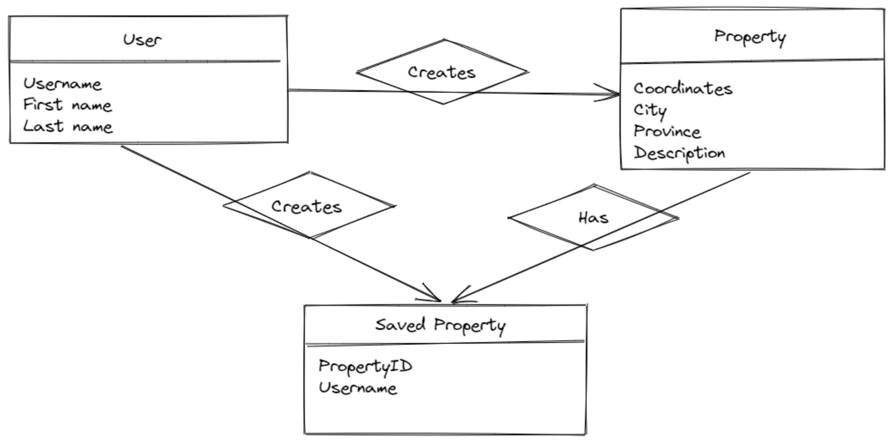

# Example Python API using Flask and DynamoDB

This template demonstrates how to develop and deploy a simple Python Flask API service, backed by DynamoDB, running on AWS Lambda using the traditional Serverless Framework.

## Implemented access patterns
Get user info
Update user info
Get properties in radius
Access patterns:

## Future access patterns
Get all user's properties
Get properties in city
Get user's saved properties
Get featured properties 

## Entity diagram

